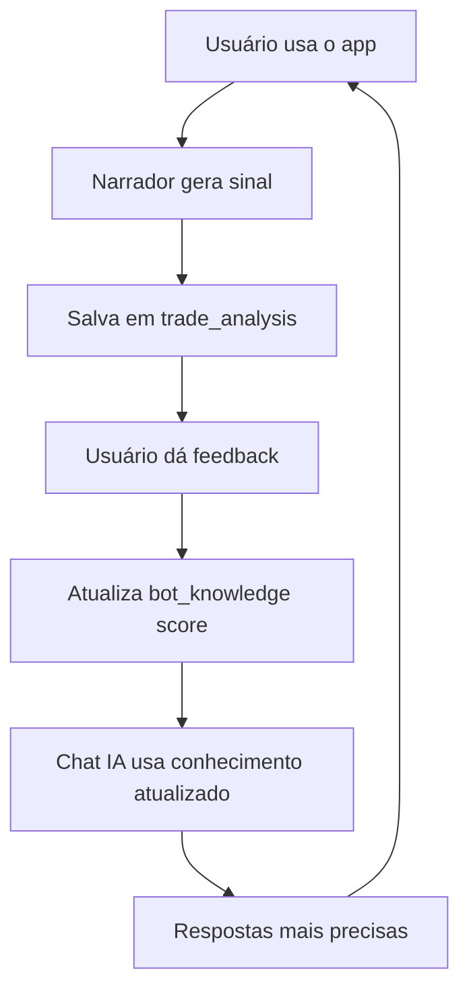

# 🎯 Dashboard Admin TradeVision IA

## ✅ O que foi criado

Dashboard administrativo completo com sistema de aprendizado contínuo para o bot trader/narrador.

### 📊 **Banco de Dados (Supabase)**

Tabelas criadas:

1. **`user_roles`** - Sistema de permissões de usuários
   - Enum: `admin`, `user`, `premium`
   - RLS: apenas admins podem ver/editar

2. **`chat_messages`** - Histórico de conversas com a IA
   - Salva todas interações user/assistant
   - RLS: usuários veem suas mensagens, admins veem tudo

3. **`bot_knowledge`** - Base de conhecimento técnico
   - Categorias: `wyckoff`, `halving`, `etf`, `liquidez`, `gestao`
   - Tracking de uso (usage_count) e precisão (accuracy_score)
   - Já populado com conhecimento inicial

4. **`trade_analysis`** - Histórico de análises de trades
   - Registra pattern, entry, stop, TP, probabilidade
   - Feedback do usuário (1-5 estrelas)
   - RLS: usuários veem suas análises, admins veem tudo

5. **`narrator_feedback`** - Feedback sobre sinais do narrador
   - Rating 1-5, was_accurate (boolean), notas
   - Para melhorar o narrador continuamente

### 🎨 **Interface Admin (`/admin`)**

4 seções principais:

1. **Dashboard** 📈
   - Estatísticas gerais (usuários, mensagens, conhecimento, análises)
   - Média de feedback
   - Visão geral do sistema

2. **Chat IA** 💬
   - Interface de conversa com o bot
   - Histórico de mensagens salvo
   - Testa e aprimora respostas em tempo real

3. **Base de Conhecimento** 🧠
   - Visualiza todos os artigos técnicos
   - Mostra contadores de uso
   - Score de precisão
   - Categorizado por cores

4. **Analytics** 📊
   - Taxa de acerto (wins/losses)
   - Padrões mais detectados
   - Média de probabilidade e confiança
   - Total de análises realizadas

### 🤖 **Edge Function `trade-chat`**

Chatbot com conhecimento técnico completo:

**Conhecimento integrado:**
- ✅ Wyckoff (Spring, BOS, CHoCH, Order Blocks, FVG)
- ✅ Halving e ciclos de Bitcoin
- ✅ ETFs e impacto na liquidez
- ✅ Caça à liquidez institucional
- ✅ Gestão de risco e stops técnicos
- ✅ Padrões de alta probabilidade

**Features:**
- Limite de 200 palavras por resposta (controle de custo)
- Usa GPT-4o-mini (econômico)
- Rastreia qual conhecimento foi usado
- Incrementa contador de uso automaticamente
- Respostas em português brasileiro
- Análise técnica objetiva e precisa

### 🔐 **Sistema de Segurança**

- ✅ RLS (Row Level Security) em todas as tabelas
- ✅ Funções SECURITY DEFINER para evitar recursão
- ✅ Verificação server-side de roles
- ✅ Apenas admins acessam `/admin`
- ✅ Redirecionamento automático se não for admin

---

## 🚀 Como usar

### 1. **Tornar usuário admin**

No Supabase SQL Editor, execute:

```sql
-- Inserir role de admin para o seu usuário
-- Substitua 'SEU_USER_ID' pelo ID do seu usuário (encontre em Authentication > Users)
INSERT INTO public.user_roles (user_id, role) 
VALUES ('SEU_USER_ID', 'admin');
```

### 2. **Acessar Dashboard Admin**

- Faça login no app
- Clique no botão **"Admin"** no header (só aparece se for admin)
- Ou acesse diretamente: `https://seu-app.com/admin`

### 3. **Testar o Chat IA**

1. Vá para **Admin > Chat IA**
2. Digite perguntas técnicas:
   - "O que é Spring no Wyckoff?"
   - "Como funciona o halving do Bitcoin?"
   - "Explique caça à liquidez"
   - "Onde devo colocar meu stop?"

3. O bot responde com conhecimento técnico profissional
4. Mensagens são salvas automaticamente
5. Conhecimento usado é rastreado

### 4. **Acompanhar Analytics**

- **Dashboard**: visão geral de uso
- **Analytics**: métricas de desempenho
- **Base de Conhecimento**: veja quais tópicos são mais usados

---

## 📝 Próximos passos para melhorar

### Aprendizado Contínuo

1. **Feedback Loop**
   - Adicione botões de feedback nas análises
   - Salve em `narrator_feedback`
   - Use para ajustar probabilidades

2. **Auto-evolução do Conhecimento**
   - Quando pattern funciona, aumenta `accuracy_score`
   - Quando falha, diminui score
   - Priorize conhecimento com score alto

3. **Fine-tuning Baseado em Dados**
   - Exporte `trade_analysis` com resultados
   - Treina modelo com casos de sucesso
   - Ajusta prompts do sistema

### Features Avançadas

1. **Sistema de Permissões Granular**
   - Diferentes níveis: admin, moderador, analista
   - Permissões específicas por funcionalidade

2. **Dashboard de Backtesting**
   - Roda bot em dados históricos
   - Mede precisão real
   - Ajusta parâmetros automaticamente

3. **Interface para Editar Conhecimento**
   - CRUD completo de artigos técnicos
   - Upload de PDFs de trading
   - Parse e indexação automática

4. **Alertas e Notificações**
   - Quando padrão de alta confiança é detectado
   - Quando feedback negativo é recebido
   - Quando métricas caem

---

## 🛠️ Estrutura de Arquivos

```
src/
├── pages/
│   ├── Admin.tsx                    # Página principal admin
│   └── Dashboard.tsx                # Dashboard trader (com botão admin)
├── components/
│   └── admin/
│       ├── AdminSidebar.tsx         # Navegação lateral
│       ├── AdminDashboard.tsx       # Overview stats
│       ├── AdminChat.tsx            # Chat com IA
│       ├── AdminKnowledge.tsx       # Base conhecimento
│       └── AdminAnalytics.tsx       # Métricas de performance
├── hooks/
│   └── useIsAdmin.ts                # Verifica se user é admin
supabase/
├── functions/
│   └── trade-chat/
│       └── index.ts                 # Edge function chat IA
└── config.toml                      # Config (trade-chat adicionada)
```

---

## 💡 Ideias para Integração com Narrador

O narrador (`useNarrator.ts`) pode se conectar ao sistema de aprendizado:

### 1. **Salvar Sinais do Narrador**
```typescript
// No useNarrator.ts, após gerar sinal:
await supabase.from('trade_analysis').insert({
  user_id: userId,
  symbol: signal.symbol,
  timeframe: signal.timeframe,
  analysis_type: 'narrator',
  pattern_detected: signal.pattern,
  probability: signal.probability / 100,
  confidence_score: 0.85,
  market_context: { news: signal.news, marketStatus: signal.marketStatus },
  result: 'pending',
});
```

### 2. **Buscar Conhecimento Antes de Gerar Sinal**
```typescript
const { data: knowledge } = await supabase
  .from('bot_knowledge')
  .select('*')
  .eq('category', 'wyckoff')
  .order('accuracy_score', { ascending: false })
  .limit(3);

// Usar knowledge para melhorar sinal
```

### 3. **Receber Feedback do Usuário**
```typescript
// Interface para usuário dar estrelas ao sinal
<Button onClick={() => rateSignal(signalId, 5)}>⭐⭐⭐⭐⭐</Button>

const rateSignal = async (signalId, rating) => {
  await supabase.from('narrator_feedback').insert({
    user_id: userId,
    signal_id: signalId,
    rating: rating,
    was_accurate: rating >= 4,
  });
};
```

---

## 🔥 Sistema Completo de Aprendizado



---

## ⚠️ Avisos Importantes

1. **Warning de senha vazada**: Ative no Supabase > Authentication > Password Protection
2. **Limite de 200 palavras**: Configurado no chat para economizar tokens
3. **Público vs Admin**: Edge function `trade-chat` é pública (verify_jwt = false)

---

## 📚 Conhecimento Técnico Incluído

### Wyckoff
- Spring Pattern (varrida + retorno)
- BOS (Break of Structure)
- CHoCH (Change of Character)
- Order Blocks
- Fair Value Gap (FVG)

### Macro
- Halving BTC (ciclos históricos)
- ETFs Spot (impacto na liquidez)
- Funding rates e OI

### Gestão
- Stops técnicos (estrutura + ATR)
- R:R mínimo 1:2
- Confluências multi-timeframe

---

## 🎓 Recursos Adicionais

- [Docs Supabase RLS](https://supabase.com/docs/guides/auth/row-level-security)
- [OpenAI API Limits](https://platform.openai.com/docs/guides/rate-limits)
- [Edge Functions Guide](https://supabase.com/docs/guides/functions)

---

**Dashboard pronto para uso! 🚀**

Acesse `/admin` com seu usuário admin e comece a treinar o bot!