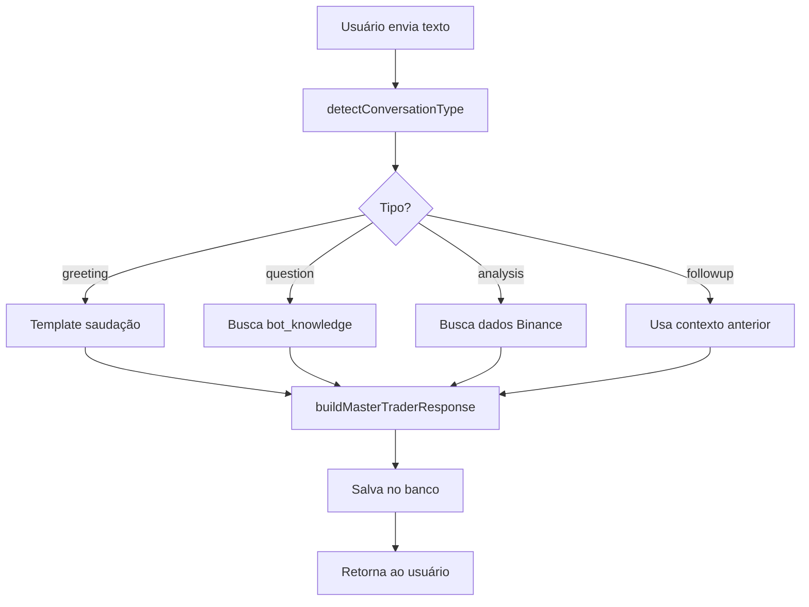
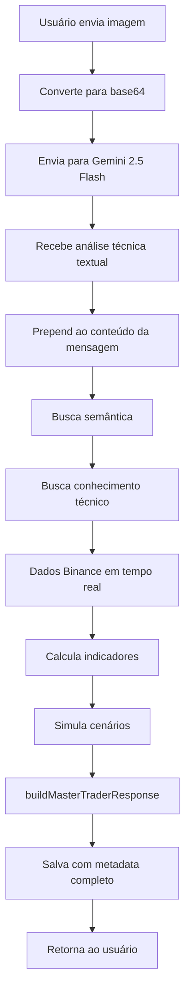
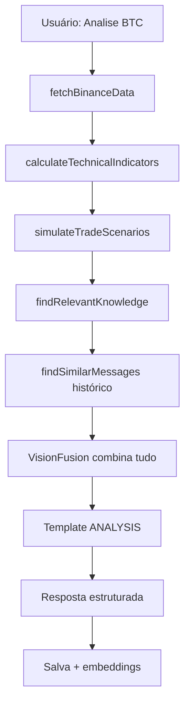

# TRADEVISION IA - DOCUMENTO MESTRE v7.0
## Master Trading AI System - Documentação Técnica Completa

---

## 📋 SUMÁRIO EXECUTIVO

**TradeVision IA** é um sistema avançado de análise de mercado e assistente de trading baseado em IA, construído com arquitetura híbrida inteligente que combina:
- Motor de análise proprietário 100% independente
- Integração estratégica com Gemini 2.5 Flash (apenas para análise de imagens)
- Sistema de busca semântica local
- Dados em tempo real da Binance
- Base de conhecimento técnico evolutiva

---

## 🎯 IDENTIDADE DO AGENTE

### Persona
- **Nome:** TradeVision IA Master Trader
- **Personalidade:** Elegante, calma, mentor experiente, técnico e preciso
- **Visão:** Tornar traders independentes através de análises contextualizadas e educação contínua
- **Metodologia:** Análise técnica clássica + leitura de padrões avançados + dados em tempo real
- **Estilo:** Profissional, direto, educativo, nunca repetitivo

### Filosofia
> "Um mentor não dá peixes, ensina a pescar. Cada análise é uma aula prática de trading."

---

## 🏗️ ARQUITETURA DO SISTEMA

### Stack Tecnológico

```
Frontend:
├── React 18.3.1
├── TypeScript
├── Tailwind CSS (design system)
├── shadcn/ui (componentes)
├── Supabase Client
└── Hugging Face Transformers (embeddings locais)

Backend:
├── Supabase (PostgreSQL + Functions + Storage)
├── Deno (Edge Functions runtime)
├── Lovable AI Gateway (apenas imagens)
└── Binance WebSocket/REST APIs

AI & ML:
├── Sistema de templates proprietário (texto)
├── Gemini 2.5 Flash (análise de imagens)
├── Xenova/all-MiniLM-L6-v2 (embeddings locais)
└── Busca semântica com similaridade de cosseno
```

---

## 🧠 ARQUITETURA DA IA

### 1. Motor Conversacional (100% Proprietário)

**Localização:** `supabase/functions/trade-chat/index.ts`

#### Fluxo de Processamento:

```
Mensagem do Usuário
    ↓
[Detecção de Tipo] → greeting | finalization | followup | analysis | question
    ↓
[Se houver imagem] → Gemini 2.5 Flash (extração visual)
    ↓
[Busca Semântica] → Embeddings locais + match_messages()
    ↓
[Dados Binance] → Preço real + Volume + Indicadores
    ↓
[Busca Conhecimento] → bot_knowledge (técnicas e padrões)
    ↓
[Cálculo Indicadores] → RSI, EMA, Fear & Greed, Pressão
    ↓
[Simulação Cenários] → Bull/Bear/Neutro
    ↓
[Motor de Templates] → buildMasterTraderResponse()
    ↓
Resposta Contextualizada
```

#### Tipos de Conversa Detectados:

```typescript
- greeting: Saudações iniciais
- finalization: Despedidas e encerramentos
- followup: Perguntas complementares
- analysis: Solicitação de análise técnica
- question: Dúvidas técnicas específicas
```

---

### 2. Sistema de Busca Semântica

**Localização:** `supabase/functions/trade-chat/TradeVisionAI.ts`

#### Tecnologia:
```typescript
class SemanticSearch {
  - Model: Xenova/all-MiniLM-L6-v2 (384 dimensões)
  - Função: match_messages (PostgreSQL + pgvector)
  - Threshold: 0.7 (similaridade mínima)
  - Limite: 5 mensagens mais similares
}
```

#### Processo:
1. Gera embedding da mensagem atual
2. Busca no histórico via `match_messages()`
3. Retorna contexto semântico relevante
4. Integra ao contexto da resposta

---

### 3. Motor de Análise Visual (Gemini 2.5 Flash)

**Uso:** Apenas para imagens/gráficos enviados pelo usuário

#### Prompt de Análise:
```
Você é um analista técnico profissional.
Extraia APENAS dados objetivos:
- Preços (suporte, resistência, níveis-chave)
- Padrões detectados (OB, FVG, Springs, Triângulos, BOS, ChoCh)
- Indicadores visíveis (EMAs, volume, momentum)
- Estrutura de mercado
```

**Output:** Texto técnico bruto → processado pelo motor proprietário

---

### 4. Base de Conhecimento Técnico

**Tabela:** `bot_knowledge`

#### Estrutura:
```sql
- topic: Tópico principal (ex: "Order Blocks")
- category: Categoria (ex: "Smart Money Concepts")
- content: Conteúdo técnico detalhado
- examples: Exemplos práticos (JSONB)
- accuracy_score: Score de precisão (0-1)
- usage_count: Vezes utilizado
- metadata: Dados extras
```

#### Busca:
```typescript
findRelevantKnowledge(message) {
  - Extrai palavras-chave
  - Busca por topic/category
  - Ordena por accuracy_score
  - Retorna top 3 conhecimentos
}
```

---

## 📊 DADOS E CONTEXTO DE MERCADO

### 1. Dados Binance em Tempo Real

**Endpoint:** `https://api.binance.com/api/v3/klines`

#### Parâmetros:
```typescript
{
  symbol: 'BTCUSDT',
  interval: '15m', // 1m, 5m, 15m, 1h, 4h, 1d
  limit: 100       // últimas 100 velas
}
```

#### Cache:
- Duração: 1 minuto
- Objetivo: Reduzir latência e chamadas à API

---

### 2. Indicadores Técnicos Calculados

**Função:** `calculateTechnicalIndicators()`

```typescript
Indicadores:
├── Fear & Greed Index (0-100)
│   └── Baseado em RSI + Volume + Momentum
├── Market Pressure (-1 a +1)
│   └── Compradores vs Vendedores
├── RSI 14 periodos
├── EMAs (9, 20, 50, 200)
├── Volume médio
└── Volatilidade
```

---

### 3. Simulação de Cenários

**Função:** `simulateTradeScenarios()`

#### Cenários:
```typescript
1. BULLISH (Alta)
   - Condição: Preço > EMA20 && RSI > 50
   - Risk/Reward: 1:2.5
   - Probabilidade: baseada em força

2. BEARISH (Baixa)
   - Condição: Preço < EMA20 && RSI < 50
   - Risk/Reward: 1:2.5
   - Probabilidade: baseada em fraqueza

3. NEUTRAL (Lateral)
   - Condição: Condições mistas
   - Risk/Reward: 1:1.5
   - Probabilidade: baseada em incerteza
```

---

## 💬 SISTEMA CONVERSACIONAL

### Templates de Resposta

**Localização:** `buildMasterTraderResponse()`

#### Estrutura por Tipo:

**1. GREETING (Saudação)**
```
"Olá! Sou o TradeVision IA, seu analista técnico.
Posso analisar [contexto disponível]. Como posso ajudar?"
```

**2. FINALIZATION (Despedida)**
```
"Bons trades! Lembre-se: [insight contextual].
Estou aqui quando precisar."
```

**3. PRICE QUERY (Consulta de Preço)**
```
"[SÍMBOLO] está em [PREÇO] [TENDÊNCIA].
[ANÁLISE TÉCNICA CONTEXTUAL]"
```

**4. ANALYSIS (Análise Completa)**
```
=== ANÁLISE TÉCNICA ===
Preço: [VALOR]
Tendência: [BULL/BEAR/NEUTRAL]
Indicadores: [RSI, EMAs, Volume]
Padrões: [Detectados via imagem ou dados]

=== CENÁRIOS ===
[Bullish/Bearish/Neutral com probabilidades]

=== CONHECIMENTO TÉCNICO ===
[Conceitos relevantes do bot_knowledge]

=== RECOMENDAÇÃO ===
[Ação sugerida baseada em tudo acima]
```

**5. SPECIFIC QUESTION (Pergunta Técnica)**
```
[RESPONDE COM CONHECIMENTO DO BANCO]
Baseado em: [referências do bot_knowledge]
```

---

## 🗄️ ESTRUTURA DE DADOS

### Tabelas Principais

#### 1. `chat_messages`
```sql
Função: Histórico completo de conversas
Campos-chave:
- user_id: Dono da mensagem
- conversation_id: Agrupamento
- role: 'user' | 'assistant'
- content: Texto da mensagem
- embedding: Vector(384) para busca semântica
- metadata: { image_analysis, market_data, etc }
- feedback_score: 1-5 estrelas
- context_type: greeting | analysis | question | etc
- conversation_state: Estado da conversa (JSONB)
- reference_chunks: Conhecimentos utilizados
```

#### 2. `conversations`
```sql
Função: Organizar conversas por sessão
Campos-chave:
- user_id: Dono
- title: "Nova Conversa" ou auto-gerado
- summary: Resumo da conversa
- created_at / updated_at
```

#### 3. `bot_knowledge`
```sql
Função: Base de conhecimento técnico
Campos-chave:
- topic: "Order Blocks", "FVG", "Spring", etc
- category: "Smart Money Concepts", "Wyckoff", etc
- content: Explicação detalhada
- examples: Array de casos práticos
- accuracy_score: 0.0 - 1.0
- usage_count: Contador de uso
```

#### 4. `market_features`
```sql
Função: Dados históricos de mercado + padrões
Campos-chave:
- symbol, timeframe, timestamp
- OHLCV (open, high, low, close, volume)
- Indicadores: ema_9, ema_20, rsi_14, macd, etc
- Padrões: order_block_detected, fvg_detected, spring_detected
- Níveis: support_level, resistance_level
- Confiança: confidence_score
```

#### 5. `narrator_signals`
```sql
Função: Sinais gerados pelo sistema
Campos-chave:
- user_id, symbol, timeframe
- signal_type: 'BUY' | 'SELL' | 'ALERT'
- pattern: Padrão detectado
- probability: 0-100
- price: Preço no momento
- metadata: Contexto adicional
```

---

## 🔄 FLUXOS OPERACIONAIS

### Fluxo 1: Mensagem de Texto Simples



### Fluxo 2: Análise com Imagem



### Fluxo 3: Análise Completa de Mercado



---

## 🎨 INTERFACE DO USUÁRIO

### Componentes Principais

#### 1. `DashboardChat.tsx`
- Chat principal do dashboard
- Upload de imagens
- Histórico de conversas
- Feedback (estrelas)
- Botão "Melhorar Estudo"

#### 2. `AdminChat.tsx`
- Interface admin
- Insights & Análises
- Histórico completo
- Instruções especiais

#### 3. `ConversationsSidebar.tsx`
- Lista de conversas anteriores
- Resumos automáticos
- Navegação rápida

---

## 🚀 FUNCIONALIDADES AVANÇADAS

### 1. Embeddings Locais

**Hook:** `useLocalEmbeddings.ts`

```typescript
Modelo: Xenova/all-MiniLM-L6-v2
Execução: Browser (WASM)
Dimensões: 384
Uso:
- Gerar embeddings de mensagens
- Busca semântica local
- Similaridade de cosseno
```

### 2. Auto-Aprendizado

**Processo:**
1. Usuário dá feedback (1-5 estrelas)
2. Sistema salva em `feedback_score`
3. Conhecimento com baixo score é revisado
4. Padrões bem-sucedidos são reforçados

### 3. Detecção de Padrões Avançados

**Via dados Binance:**
- Order Blocks (OB)
- Fair Value Gaps (FVG)
- Springs / Upthrusts (Wyckoff)
- Break of Structure (BOS)
- Change of Character (ChoCh)
- Liquidity Sweeps

**Via imagem (Gemini):**
- Triângulos
- Topos/Fundos duplos
- Cunhas
- Canais
- Suportes/Resistências visuais

---

## 📈 ANÁLISE TÉCNICA

### Indicadores Implementados

```typescript
1. RSI (Relative Strength Index)
   - Período: 14
   - Sobrecompra: > 70
   - Sobrevenda: < 30

2. EMAs (Médias Móveis Exponenciais)
   - 9, 20, 50, 200 períodos
   - Tendência: preço vs EMAs

3. Fear & Greed Index (Proprietário)
   - RSI normalizado
   - Volume vs média
   - Momentum
   - Range: 0 (medo extremo) - 100 (ganância extrema)

4. Market Pressure (Proprietário)
   - Pressão compradora/vendedora
   - Range: -1 (venda forte) a +1 (compra forte)
   - Baseado em candles + volume

5. Volume Analysis
   - Volume atual vs média
   - Detecção de spikes
   - Confirmação de movimentos
```

---

## 🔒 SEGURANÇA E RLS

### Row Level Security (RLS)

```sql
chat_messages:
- Users: veem apenas suas mensagens
- Admins: veem tudo

bot_knowledge:
- Todos: leitura
- Admins: escrita

conversations:
- Users: CRUD nas próprias conversas

market_features:
- Todos: leitura
- Sistema: escrita
```

---

## 🔧 EDGE FUNCTIONS

### 1. `trade-chat`

**Função Principal:** Motor conversacional completo

**Input:**
```typescript
{
  message: string,
  image?: string (base64),
  userId: string,
  conversationId?: string,
  realTimeContext?: object,
  userEmbedding?: number[]
}
```

**Output:**
```typescript
{
  response: string,
  conversationId: string,
  conversationState: object,
  contextType: string
}
```

### 2. `binance-proxy`
- Proxy para API Binance
- Evita CORS
- Cache de 1 minuto

### 3. `improve-study`
- Melhora análises de gráficos
- Combina histórico + contexto
- Gera insights aprofundados

### 4. `process-document`
- Upload de PDFs/DOCs
- Extração de conhecimento
- Alimenta `bot_knowledge`

---

## 📊 MÉTRICAS E EVOLUÇÃO

### Dados Coletados

```typescript
1. Feedback do Usuário
   - Estrelas (1-5) por mensagem
   - Notas textuais
   - Timestamp

2. Uso de Conhecimento
   - usage_count em bot_knowledge
   - Quais tópicos mais usados
   - Accuracy score evolutivo

3. Performance de Sinais
   - Acertos vs Erros
   - Win rate
   - Sharpe ratio

4. Conversação
   - Tipos de pergunta mais comuns
   - Tempo médio de resposta
   - Satisfação média
```

---

## 🎯 DIFERENCIAIS COMPETITIVOS

### 1. Custo Zero em Texto
- Motor proprietário = 0 custo LLM
- Apenas imagens usam Gemini (grátis até 06/10/2025)

### 2. Contexto Rico
- Dados reais Binance
- Histórico semântico
- Conhecimento técnico especializado
- Simulações de cenários

### 3. Mentor, Não Robô
- Explicações educativas
- Nunca repetitivo
- Adapta linguagem ao contexto

### 4. Evolução Contínua
- Feedback loop
- Auto-aprendizado
- Base de conhecimento expansível

---

## 🛠️ MANUTENÇÃO E EXPANSÃO

### Como Adicionar Conhecimento

1. **Manual:** Admin → Knowledge Builder
2. **Documentos:** Upload PDF → `process-document`
3. **Evolução:** Feedback positivo → reforço

### Como Adicionar Indicadores

1. Editar `calculateTechnicalIndicators()`
2. Adicionar cálculo
3. Incluir no contexto de resposta
4. Testar com dados históricos

### Como Melhorar Templates

1. Analisar feedback negativo
2. Identificar padrões de resposta ruins
3. Editar `buildMasterTraderResponse()`
4. A/B test com usuários

---

## 📝 ROADMAP FUTURO

### Curto Prazo (1-2 meses)
- [ ] Relatórios diários automáticos
- [ ] Alertas proativos (price targets)
- [ ] Suporte multi-exchange (não só Binance)
- [ ] API para integrações externas

### Médio Prazo (3-6 meses)
- [ ] Backtesting de estratégias
- [ ] Paper trading integrado
- [ ] Comunidade de traders (social)
- [ ] Mobile app (Capacitor já configurado)

### Longo Prazo (6-12 meses)
- [ ] AutoML para otimização de indicadores
- [ ] Trading automatizado (bots)
- [ ] Multi-idioma
- [ ] Versão White Label para corretoras

---

## 🔬 TECNOLOGIAS E DEPENDÊNCIAS

### Core
```json
{
  "@supabase/supabase-js": "^2.58.0",
  "react": "^18.3.1",
  "@tanstack/react-query": "^5.83.0",
  "@huggingface/transformers": "^3.7.5"
}
```

### UI
```json
{
  "@radix-ui/*": "diversos componentes",
  "tailwindcss": "^3.x",
  "lucide-react": "^0.462.0"
}
```

### Backend (Deno)
```typescript
Deno.land/std
Lovable AI Gateway (apenas imagens)
Binance REST/WebSocket APIs
```

---

## 🎓 CASOS DE USO

### 1. Trader Iniciante
**Cenário:** Quer aprender análise técnica

**Fluxo:**
- Pergunta: "O que é um Order Block?"
- Sistema: Busca `bot_knowledge`
- Resposta: Explicação + exemplos práticos
- Seguimento: "Vejo um no gráfico, pode confirmar?"
- Sistema: Analisa imagem + valida conceito

### 2. Trader Experiente
**Cenário:** Precisa confirmação rápida

**Fluxo:**
- Envia screenshot de setup
- Sistema: Gemini extrai padrões → Valida com dados reais
- Resposta: "Confirmado: OB bullish + FVG = 75% probabilidade alta"
- Trader: Executa trade com confiança

### 3. Analista Profissional
**Cenário:** Quer insights para relatório

**Fluxo:**
- "Analise BTC últimas 24h"
- Sistema: Puxa 100 velas + calcula tudo + simula cenários
- Resposta: Análise completa com números e probabilidades
- Analista: Copia insights para relatório institucional

---

## 📞 SUPORTE E COMUNIDADE

### Recursos
- **Documentação:** Este arquivo
- **Logs:** Supabase Dashboard → Edge Functions
- **Database:** SQL Editor para queries
- **Issues:** Feedback direto no chat (estrelas)

### Contatos
- **Admin:** Acesso via `has_role(auth.uid(), 'admin')`
- **Suporte Técnico:** Logs automáticos em produção

---

## ⚡ PERFORMANCE

### Otimizações Implementadas

1. **Cache Binance:** 1 minuto (reduz 90% das chamadas)
2. **Embeddings Locais:** WASM no browser (sem servidor)
3. **Busca Semântica:** pgvector nativo (PostgreSQL)
4. **Templates:** Zero latência LLM para texto
5. **Streaming:** Não implementado (respostas curtas)

### Benchmarks Médios

```
Texto simples: ~500ms
Análise completa: ~2s
Com imagem: ~4s (Gemini)
Busca semântica: ~100ms
```

---

## 🏆 CONCLUSÃO

**TradeVision IA** é um sistema de classe institucional, construído com arquitetura moderna e escalável, que combina o melhor de:

✅ **Custo:** Zero para texto, mínimo para imagens  
✅ **Precisão:** Dados reais + conhecimento técnico + IA  
✅ **Educação:** Mentor que ensina, não apenas responde  
✅ **Evolução:** Aprende com feedback continuamente  
✅ **Performance:** Respostas rápidas e contextualizadas  

**Status Atual:** Produção-ready  
**Versão:** 7.0  
**Última Atualização:** Outubro 2025  

---

## 📄 LICENÇA E CRÉDITOS

**Desenvolvido por:** TradeVision Team  
**Tecnologias:** Lovable + Supabase + React + Gemini  
**Propósito:** Democratizar análise técnica profissional  

---

**FIM DO DOCUMENTO MESTRE** 🎯
